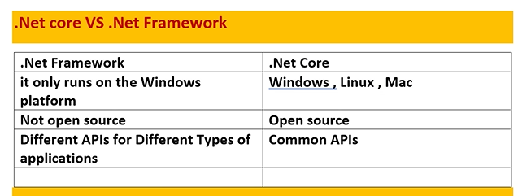
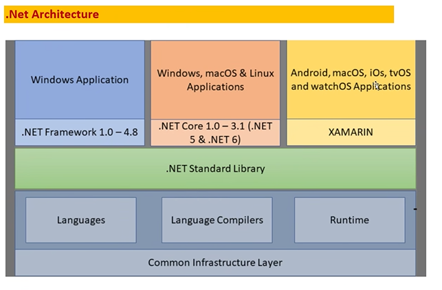
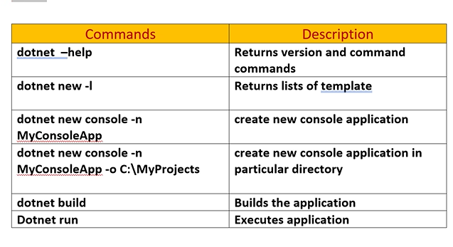
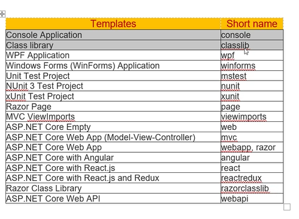
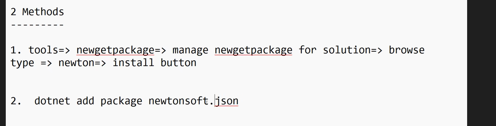
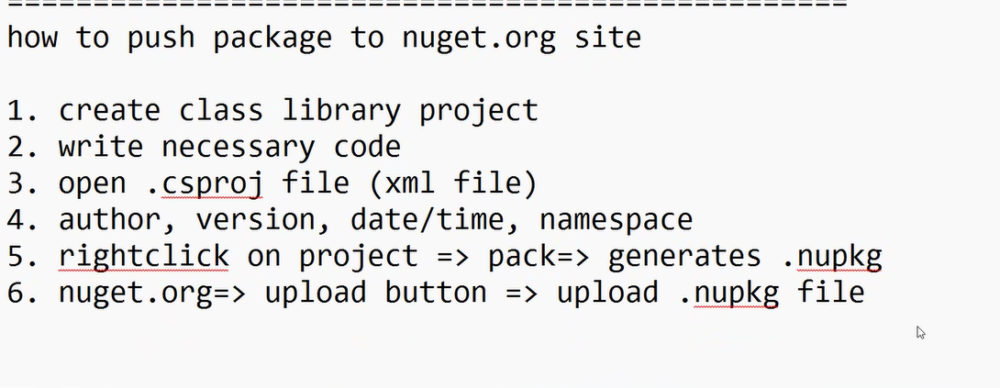
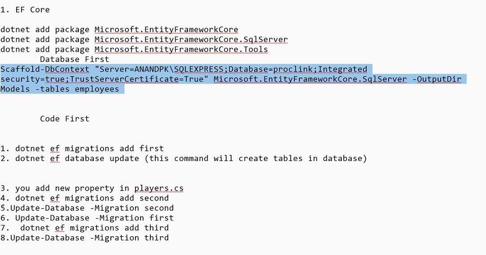

# CORE

- .Net comes in two flavors : .Net framework
                              .Net Core


- both have console application
 - .NET Core framework can be used to build diff types of applications such as mobile,desktop,web,cloud,IoT,ML,Microservices,game etc.

- .Net framework is not cloud friendly and doesnt support microservices

- .Net Core is written from scratch



- libraries are different for mobile,web,... apllications in framework

- libraries are common in core


## BENEFITS

- works on very platform

- modular in nature (only required packages can be used)

## .NET CORE FRAMEWORK
- CLI tools 

- flexible deployment: we can deploy in web server, docker,cloud

- mutiple environment and development mode : we can configure the enviroment for specific development or testing...

- built in support of cloud

- performance wise it is faster than framework


- CLR is called CoreCLR in core

- FCL is called CoreFX 

- csc compiler is Roslyn(platform where all compilers for diff languages are kept) compiler in core


## .NET ARCHITECTURE



- XAMARIN is for embedded systems 


## .NET CORE CLI

- we can create , build, run and publish the project from cli



- to add the library -> right click on project and choose project reference.

- then import namespace of the library

- class libraries are used to store the logic , they can't be run.

- to create class library in console
```c#
dotnet new classlib -n libname
```



- to share our libraries to other - share the dll file

- to download library packages 



- to upload our own library package : the name of the library must be unique

s


## ENTITY FRAMEWORK CORE

- how to interact with database

1. Install the package
dotnet add package Microsoft.EntityFrameworkCore
dotnet add package Microsoft.EntityFrameworkCore.SqlServer
dotnet add package Microsoft.EntityFrameworkCore.Tools

2. now choose whether to use database first or code first
- if database first then run
```c#

Scaffold-DbContext "Server=AKSHITA-GTEHYD\SQLEXPRESS;Database=proclink;Integrated security=true;TrustServerCertificate=True" Microsoft.EntityFrameworkCore.SqlServer -OutputDir Models -tables employees
 

```

scaffold -> generates classes and methods automatically

3. now import the namespace and create object using the class name of context in model. 


- If code first approach

- MIGRATIONS - to connect with databse in core

```c#
dotnet ef migrations add first // creates a migration file with name first
dotnet ef database update //this command will create tables of first

//suppose we added a new property and want to update in sql
dotnet ef migrations add second
//to update the second migration
Update-Database -Migration second
//suppose we want to revert to first migration
Update-Database -Migration first
```

 
