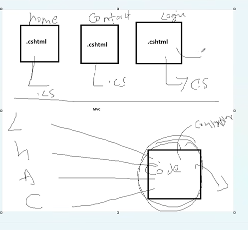
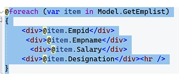
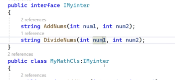
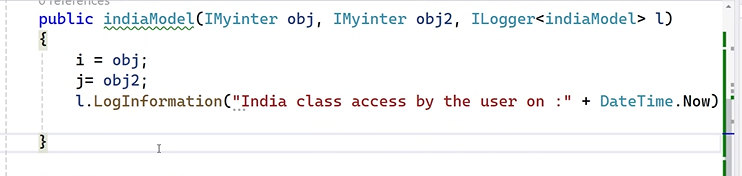

# REQUIREMENTS

1. web server : to host websites, to create domains,processing server side language

- html files are directly compiled by browser(has parser that compiles html and css codes), no new compiler needed.
- browser doesn't have C# compiler
- web server compiles server side language(C# code).
- web server has built in compiler for c#


2. physical path : the path where the file is stored
3. virtual path : any that starts with http

http://localhost/hello.html

4. protocol : using HTTPS protocol(carry data between client and server)

5. Client : browser (chrome,morzilla,edge,firefox,safari)


- IIS (inbuilt web server in windows)
1. write click on default site , click add application.
2. enter the alias name amd path of folder where file is stored
3. click Ok
4. Click Content View (shows what pages are there )


- to develop a web application in .NET we have two ways
1. using framework : using asp.net
2. using core : using asp.net core Razor or asp.net core mvc


## WHY NOT ASP.NET

-  ASP.NET only for windows , whereas asp.net core is for windows,mac and linux

- asp.net core has better performance

- asp.net core runs on both .NET core and framework

- Asp.Net supports web forms (everything is drag and drop Eg: drag and drop button, the code is written automaticaaly in web form)

- Aso.Net uses only IIS web server, whereas Asp.Net core is not dependent on IIS

- Asp.Net core supports more languages than asp.net

- asp.net core stores files in json whereas asp.net stores in xml

- asp.net core supports containers such as docker

- asp.net core -> no need to comiple the file again and again when changes are made in code, refreses automatically once file is saved.


# DIFFERENCE BETWEEN RAZOR PAGES AND MVC PAGES

- both are cross platform(supports windows , linux, mac)

- both supports multiple webservers

- razor is suitable for very small and intermediate project

- mvc designed for very large project

- razor pages lacks few features comapred to mvc

- in razor each page contains its own code (separate .cs file), mvc all the codes is centralized (common .cs file)


     


# RAZOR 

- razor is server side pages (web server process the page)

- includes C#,html,css javascript 

- syntax begins with @ (@ repersents c# code)



- file extension is .cshtml 

- lightweight 

- cross platform


- Files that are created when we create a razor project

1. Dependencies : where packages installed are stored

2. Connected Services : stores online services ( Web service or API Service)/ services used from online site(we can use the code we need that already exists online)

3. Properties : has launchsettings.json (has information about web servers (Kestrel webserver))

- by default .Net core uses kestrel web server( runs on all platforms)

- visual studio has two web servers : 
       1. IISExpress web server (only for windows) => basic version of iis
       2. kestrel web server

4. wwwRoot : all client side pages (html,css,javascript,bootsrap,xml,json etc)

5. Pages : for server side pages (C# pages) 
      - Layout pages : contains common features of all pages
      - viewimports : contains common namespaces
      - viewstart : layout page to be used.(to apply the layout page)

6. AppSettings.json : stores configuration settings like database path, logging,etc

7. Program.cs : contains logic to create kestral web server , authentication programs, session features and exception handling features
```c#
var builder = WebApplication.CreateBuilder(args); //to create kester web server
```


- to call methods of diffrent class we use @Model


- to take input from user to calcualte two numbers

```c#
//in cs page
 public class mycls()
 {

     public string txt1 { get; set;}
     public string txt2 { get; set;}

 }


 public class IndexModel : PageModel
{
    public int res { get; set; }


    public void OnPost(mycls obj)
    {
        //this logic will be executed when submit is clicked
         res = int.Parse(obj.txt1) + int.Parse(obj.txt2);

    }
}


//in cshtml

<form method="post">
    <input type="text" name="txt1"/>
    <input type="text" name="txt2"/>
    <input type="submit" value="Addnumbers"/>

</form>

@Model.res
```

```html
<a class="btn btn-primary" asp-page="viewContacts">Viewcontact</a>

```

- Query String -> pass data from one page to another


- OnGet Method -> intialization code is written , what logic hould be displayed when oage is loaded -> called when page is loaded from server to client

- Onpost method : to send data from client to server


# PROGRAM

- The Program.cs file is the program.cs file in console app , to convert to razor project the code s written in program.cs


```c#
// will also load  launchsettings.json and appsettings.json

//creates and loads kestral server in memory

// will return an object(webapplication builder)

//using this return type , we can configure add a services , dependency injection and middleware
var builder = WebApllication.CreateBuilder(args);

//to convert to razor project 
builder.Services.AddRazorPages();

// to load the services to kestral web server
// using app we can define rules for project -> called builtIn middleware
//the moment url is given url execution starts
// app is used to use the services
// the order of execution of services 
//Eg: app.UseAuthentication();
    //app.MapRazorPages();
var app = builder.Build();

// if wrong url entered then display error message with status code
app.UseStatusCodePages();

//now if wrong url is entered , it will redirect to error page and the wrong url entered is changed to errorpage url
app.UseStatusCodePagesWithRedirects("ErrorPage");

// it will redirect to errorpage but the wrong url stays the same 
app.UseStatusCodePagesWIthReExecute("/ErrorPage");


//what code should execute in development environment
// we can change the evironement to testing or production or development in launch.json
//in ASPNETCORE_ENVIRONMENT : "Development"


//run this code if it is not in development environment
if (!app.Environment.IsDevelopment())
{
    //for run time error -> if run time error then go to error page
    app.UseExceptionHandler("/Error");
    
    app.UseHsts();
}


//will decide whether client side pages can execute or not
// if UseStaticFiles not used then client pages are not executed
app.UseStaticFiles()//can use client side pages(stored in wwwRoot)

//whether razor pages can execute ot not (.cshtml)
app.MapRazorPages();


//if server pages are not present --run this cpde
app.MapGet("/hi",()=>{"Hello World"});

//after app.Run method we cannot give any rules
app.Run();


// for custom middleware
app.Use(async (context, next) =>
{
    await context.Response.WriteAsync("<div> Hello World from the middleware 2 </div>");
    await next.Invoke();
    await context.Response.WriteAsync("<div> Returning from the middleware 2 </div>");
});

```

- create the objects in program class, so that all other pages can use the objects, to reduce use on memory


## DEPENDENCY INJECTION 

- A coding pattern in which a class receives the instances of objects it needs (called dependencies) from an external source rather than creating them itself


- Builder
- to use these we have to use Interface


```c#
//separate object is created for every request
// every time the url is loaded a object is created

builder.Services.AddTransient();

// single object is created for each user
//no matter how many requests a user makes , the same object is used 
// for Eg: one user cart is not visible to another user
builder.Services.AddScoped();


// one object is used by all the users
//Eg: while booking tickets , the blocked seats are  not visible to other users
builder.Services.AddSingelton();
builder.Services.AddLogging();


```c#
//anywhere in project where IMyinter interface is used, create a object for MyMathCls
builder.Services.AddTransient<IMyinter,MyMathCls>();

IMyinter i; //global variable
public indiaModel(Imyinter obj){//Imyinter obj = new MyMathCls() -> created everytime page is loaded
     i=obj;
}


// single object is created for user
builder.Services.AddTransient<IMyinter,MyMathCls>();


//guid -> generates unique id of 24 digits
g=Guid.NewGuid(); 


//Logging
public newPageModel(IMyinter obj,ILogger<newPageModel> l)
{
    i = obj;
    //built in interface 
    l.LogInformation("New Page class accessed by user on :"+DateTime.Now);

}
builder.Services.AddLogging(
    c=>{c.AddConsole(); c.AddDebug();c.AddEventLog();} //can be stored in either console,debug window or eventlog
);




//Routing
//Convention Routing -> written in program.cs 
// alias names for all files can be written
builder.Services.AddRazorPages(
    c=> c.Conventions.AddPageRoute("/newPage","abcde")
       
);

//page routing -> write in newPage.cshtml 

@page "/bharath"