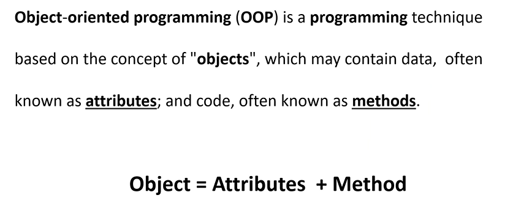

## METHOD

```cs
public static void methodname(){

}
```
- access modifiers
- by default access modifier for function is private
- by default acess modifier for class is internal 
- static means the method can only be called by class name
- if not static the method can be called by object
- 


- Optional parameter -> we can pass default values to parameters if the user does'nt give input.
- if we want to only pass value to one varaible - Named parameter


- if we want to return more than one value


p & q will act as reference variables


## ARRAYS

- collection of variables

- types of arrays
1. single dimension arrays
2. multi domension arrays
3. jagged arrays

#### Single dimension - an array which can hold only one row at a time

```cs
int[] a = {10,20,30};
Console.WriteLine(a[0]);

foreach (int i in a)
   Console.WriteLine(i);

Console.WriteLine(a.Length);

//to know the dimension of array
Console.WriteLine(a.Rank);

int[] b = new int[3];
```

- for loop is read and write loop
- foreach loop is read only loop

- for loop prints part of the values

- foreach prints all values

- for loop works with indexes

- foreach : no index required  


#### MULTI DIMENTIONAL ARRAY

- an array which can hold more than 1 row at a time

```cs
int[,] a = 
  {
    {10,30,40},
    {23,100,34},
    {90,34,45}
  };

Console.WriteLine(a[1,1]) //100
Console.WriteLine(a.Length()); //returns the number of values

Console.WriteLine(a.GetLength(0)); // length of rows
Console.WriteLine(a.GetLength(1)); //length of columns
```


#### JAGGED ARRAY

- type of multidimensional

- row is fixed, columns not fixed

```cs
int[][] a = new int[5][];
a[0] = new int[2]{10,20};
a[1] = new int[5]{10,30,50,670,70};
a[2] = new int[1]{10};
a[3] = new int[0];
a[4] = new int[4] {10,20,45,70};
```


# CLASSES AND OBJECTS

- every object has properties and behaviour.

- properties -> data members
- behaviour -> functions



- we acheive properties by declaring varaibles


- Object Creation 
   - once class creates, we can store data in class using object
    ```cs
     className Obj = new className();
    ```

- csc filename -> to compile the code in notepad

- we use property type for properties 

- property type also does validation 

- set block is called when the user assign the value to property

- get block is called with the user prints the value of property

- a property without get block is called is writeonly properly

- a property without set block is called readonly property

- we can use automatic property when you do not need validations

```cs
int a;
public int age
{
    //validation code
    get{
        return a;
    }
    set{
        //when we assign a value to a property the set block is called
        a = value;
        if(value>1000){ //value is the value assigned to the property
            Console.WriteLine("Invalid age");
        }
    }
}
```

- object intializer -> instead of intilalizing separately we can inti;azie while declaring object itself
```cs
employee newObj = new employee() 
{ firstname="Akshita", lastname="Mandala", monthlysalary=50000,dept="Developer"};
```


### TYPES OF CLASSES

1. instance class (class that supports object creation)

2. static class (can only contain static members only, non static not allowed, int this case we cannot create object) . We can call members using classnames 

3. sealed class : this type of class cannot be inherited, Object creation possible

4. abstract : it cannot create object for abstract class but can inherit

5. partial class : this will allow to share the class members in more than one file -> we can store methods in separate files but belong to same class


- the variables which are used again and again use static for them


- inheritance 


#### CONSTRUCTORS

- to call the methods automatically when object is created
- same name as class

- Instance and static constructor : static is called only one time whereas intance constructor is called whenever a object is created.


# ENCAPSULATION

- Advantage : Security
- acheived by using class
- wrap variables and methods in a class 

# INHERITANCE

- Advantage : Code resulability
- one class will use members of another class
- the class which uses the feature is called as derived class
- the class that provides the feature is called as base class

- C# supports only single inheritance

```cs
A{
    show(){}
}
B:A{
    display();
}
B ob = new B();
ob.show();
ob.display();
```

- the child class and base class can have same methods -> when they have same methods to call the method of the base class we can use base keyword
```cs
base.funcname();
```


# POLYMORPHISM

- Advantage : performance + code flexibility
- poly => Many
- morh => form

1. static (compile) -> methods with same name, but different signatures(parameters)
- acheived by method overloading (methods with same name)
 Eg : WriteLine method 

2. dynamic (runtime) -> methods with same name and same signature but different implementation.
- acheived by method overridden
- min two classes req
- inheritance is a must
- in the base class you need to use virtual(which means the method can be replaced at runtime with base class function)
- override keyword must be used in derived class

- base class objects can call derived class functions.


- Shadowing : by using new keyword in the method , if you do not wish to override a method, we can use a new keyword. It is a way to inform user that method is not overridden.

# ABSTRACTION

- code simplicity 
- not complete
- display only necessary features of an object , encapsulate the uncessary things to outside the world
- Hiding is acheived using private access modifier


 


