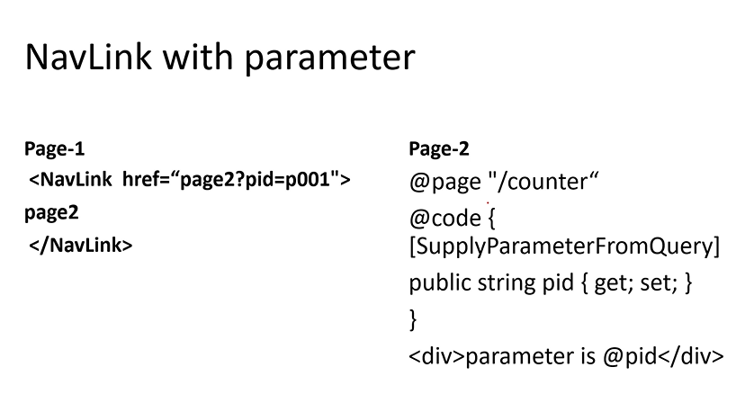
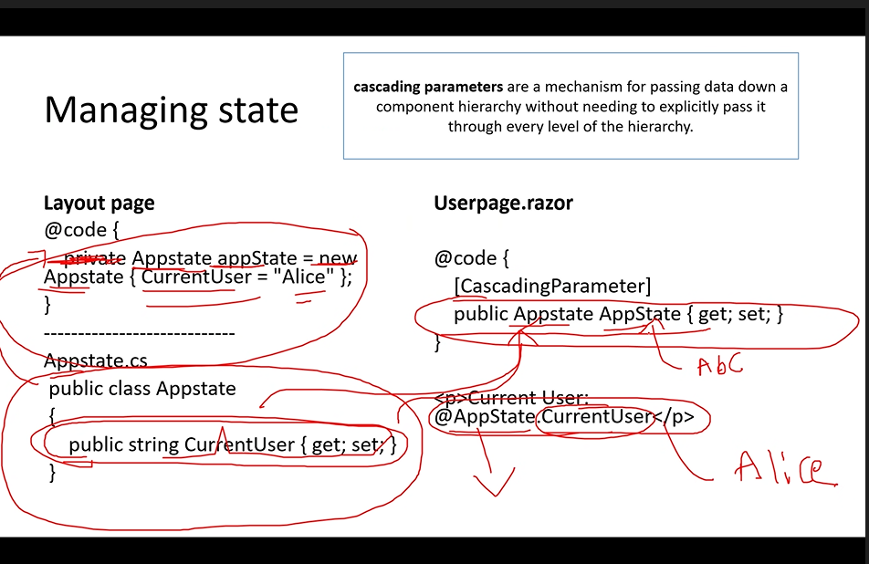

# INTRODUCTION

- .Net frontend web framework for creating single page web applications(entire website is single page)

- Eg:Email

- c# language

- single page is loaded in browser and that single page will have hyperlinks , by clicking on the hyperlink the content changes but the page remains the same

- Blazor = Browser + Razor

- component -> contains data thats keeps on changing dynamically in the page

- single page has many components


# FEATURES 

- allows to create rich UIs using telerik framework

- compatible with windows , linux and macOS

- same language for both frontend and backend


# HOSTING OPTIONS

- Blazor WebAssembly (CSH) - application runs on browser
- Blazor Server (SSH) - application runs on server and the result in given in html format which browser runs


# HOW BLAZOR CSH WORKS?

- C# code runs inside the browser using web assembly 


- the run time is dowloaded inside the browser

- Assembly -> dll/exe files

- these dll files(the files are in il format) are send to browser

-  the runtime converts the files from il format to binary format


# HOW THE BLAZOR SERVER WORKS?


- using signal R we can communicate between client and server

# BLAZOR PROJECT STRUCTURE


- for every page make sure to write @page "/aliasname" for the page to access when we run 


# ROUTING AND NAVIGATION

## Using code behind

- we can write all c# code in a separate file called code behind

- we can create using the same name of the page
Eg: Home.razor.cs


- if the class name is not matching we should use inherits in the razor page


## ROUTING

#### navigating between pages using c#


#### navigating using html 
- we are not using anchor tag because it reloads the entire page , navlink doen't load the page again .
```html
<NavLink href="weather">
    Weather
</NavLink>
```

- we can navigate using parameter
- we are navigating from page 1 to page 2
- we have to create a property in page2 with same name of the key 
- and use [SupplyParameterFromQuery] to assign the value to the property from page1 




#### navigating using code

- to navigate we need to use inbuilt class NavigationManager
- to use inbuilt classes in blazor we need to use @inject
- use obj.navigateTo("/pagename") in the function 


- we can also pass parameter in the code navigation
```c#
@page "/page1"
@inject NavigationManager obj;
<h3>Page1</h3>

@code {


    public void show(){
        obj.NavigateTo("/page2?pid=p001");
    }

}


    <input type="button" value="click here" @onclick="show"/>

```

#### Navigating without query string (using Parameter)


- to interact with database in blazor we have to use webAPi 

- run both webApi and blazor projects simultaneously to connect with database 

```c#
    using System.net.http.json


    //to implement dependency injection
    public interface IMovie
    {

        //showmovie, bookings, register
        Task<HttpResponseMessage> AddUser(User r);
       
        
    }

    public class MovieDet:IMovie
    {
        //using the object of class HttpClient we can use get,post methods 
        HttpClient client;
        public MovieDet(HttpClient h)
        {
            client = h;
        }

        //used to connect with 
        //when task is used that method is running in different processor
        public async Task<HttpResponseMessage> AddUser(User data)
        {
            // data contains all the values of textbox in the register page
            //logic to send data to webapi
            //PostAsJsonAsync -> acts as post method and converts data to json format 
            //the url is the url of register page in webapi
            // data object is the values of text boxes and passed to webapi and in turn updated to database
            //Async means methods run parallely 

            // async and await are used in combination 

            //await means wait until the method called is completed and then execute the next line 
            var res = await client.PostAsJsonAsync<User>("https://localhost:7138/api/Cinema/Register", data);

            //get method
            client.getfromjsonasync("url og get method of webapi");
            return res;

        }

    }
    
    //in program.cs
    builder.services.AddScoped<IMovie,MovieDet>

    //to call the AddUser method in some other page instead of creating a object 
    @inject IMovie r;

    r.AddUser();
```

- Now in register page , write the logic to add the user details 

```c#

    User u = new User();
    string msg;
    public void RegisterUser()
    {

        var res = m.AddUser(u);

        

        if (res != null)
        {
            msg = "new user created successfully";
        }
        else
        {
            msg = "Error Occured! Please try again";
        }
    }
```


- Seesion  variable - to use the variable in project

```c#
Blazored.SessionStorage.Isessionstorage r
r.setItemAsStringAsync("key","value");
```


- add policies in program.cs of webapi project so that blazor project can cannot

```c#
//used for security purposes
//so that all cannot connect to web api  , for security purposes
//CORS => cross origin request
builder.Services.AddCors(options =>
{
    options.AddPolicy("EnableCORS", builder =>
    {
        builder.AllowAnyOrigin() //we can also give the url , so that only certain clients can access it (if url not given all can connect with webapi)
        .AllowAnyHeader() // we can also pass the data from body
        .AllowAnyMethod(); //allow all get,put,post method 
    });
});

```


# JAVASCRIPT INTEROP (Sharing resources)

- to use methods that are already exists in javascript or vice versa

- allows you to call javascript functiond from .NET code and vice versa

- useful for using existing js libraries or APIs that are not available in .Net

## js to Blazor

- can be called using 

```c#
@inject IJSRuntime obj
```


- the method must be same in both 

- can also pass parameters


## Blazor to Js

- use [JSInvokable] attribute on top of functions in blazor

- give the project name and method name as parameters in invokeMethodAsync method .

- if the function is returning something use then in js to print.


# PARENT AND CHILD COMMUNICATION

- one razor component can call another razor component


- parent component -> caller

- child component -> the component called


- we can also pass data from parent to child


- child to parent communication
      - events are used
      - we can send data to parent also
      - first declare the event - string is type of data we are sending to parent
          public EventCallback<string> OnMessage{get; set;}


# MANAGING STATE

- we can directly pass the data to any child 

- if you want to pass the value to any child , use property of type class and use attribute CascadingParameter





# SIGNALR

-  a library
-  written in javascript
-  client server architecture
- used in web technology
- used to facilitate communication between client and server allowing for immediate exchange of data without the need for frequent reloading
- keeps an open connection , server can push updates to everyone as soon as something changes.


- broadcast -> boardcasts message to diffrent type of clients

- works in blazor web app(server side projects) 
- doesnt work in b;azor standalone projects

- dowload package microsoft.aspnetcore.SignalR
- import the signalR library from client-side library in wwwroot


### BASICS OF JQUERY


- in javascript we declare function and call it using onclick
```js
<input type="button" value="click here" onclick="hello()" />

<script>


    function hello() {
        alert("hello world")
    }
</script>

```

- in jquery we can use id and use click function
```js
<input type="button" value="click here" id="b1" />
<script src="~/jquery/jquery.js"></script>
<script>


    $("#b1").click(hello);
    function hello() {
        alert("hello world")
    }
</script>

```

- we can also write 
```js
 <input type="button" value="click here" id="b1" />

 <script src="jquery/jquery.js"></script>
 <script>


     $("#b1").click(function () {
         alert("hello world")
     });


 </script>
```
 - we can take value from text box and print
```js
 <input type="text" id="t1" />

 <script>
  $("#b3").click(function () {
     alert($("#t1").val())
 });

 </script>
```


 # UNIT TESTING

 - testing individual methods

 - Bunit is a unit testing framework for blazor 

 - for blazor projects only

 - only for c# and razor code(html)


 ## Steps

 1. Create  a new xUnit test project
 2. install bunit package
 3. add reference of project to be tested(right click on the testing project and add project reference to call the functions)


 

 - RenderComponent -> to call the specific component
 - now cut will have reference to the component
 - cut.Instance will create a object of the component 
 - now we can call the method 
 - now match the expected value with the value returned using class Assert


 - we can also perform testing on html tags
 

 -var paragraph= cut.Find("p") => find is used for searching html elements 
 - paragraph variable has all the information of p tag
 - paragraph.TextContent -> gives the content of the paragraph tag


 - we can also perform tests by ID -> b1 is the ID of button 
 


 # AUTHENTICATION

 - blazor webassembly -> framework for building web applications. For  client side 

 - authentication : process of verifying the identity of a user

 - Authorization : determines what authenticated users are allowed to do

 - default type of authentication -> anonymous (anyone can access)

 - Classes & Components in Blazor Authentication

 1. AuthenticationStateProvider : base class that provides authentication state information to the blazor components . This class contains methods by name NotifyAuthenticationStateChanged which is used to notify application whether the user is authenticated or not.(to inform other pages whether the user is logged in or not)


 2. AuthenticationState : represents the authentication state of user , whther the user has permission to access the page or not. Has a method isAuthenticate .

 3. ClaimsPrincipal : represents the user in terms of their identity and claims


 4. AuthorizeView : conditionally displays UI content based on the users authentication state. Has teo blocks authorized and NotAuthorized

  


- we have to inherit a base class AuthenticationStateProvider


- GetAuthenticationStateAsync -> inbuilt method (defualt behavior of the application that is anonymous)

- anoymous object is of type class claimprinicple

-  when we logout , it returns to anonymous


- program.cs 
 
MockAuthenticationStateProvider -=> for custom authentication


- the user is authenticated and notified to other pages by calling the method MarkAsUserLoggedIn 


- App.razor  => cascadingAuthentication (apply fro child pages also)


