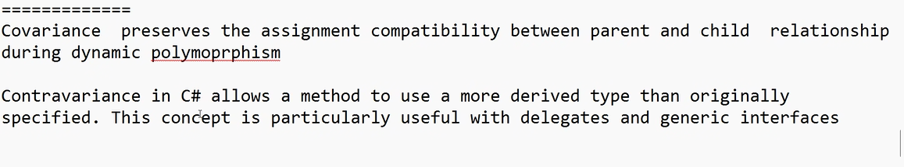
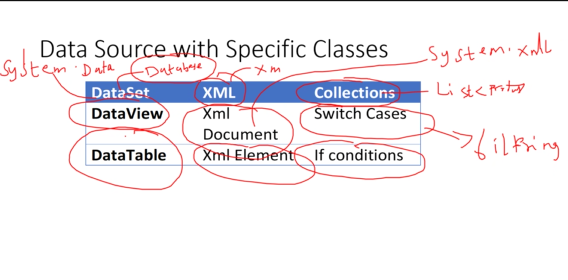

# C# LANGUAGE FEATURES

### IMPLICIT TYPE LOCAL VARIABLE

- variant keyword -> var 

- var -> typecast to  datatype based on value assigned to variable. 
```cs
var a = 10; 
var s = "Hello";
var obj = new DelegateDemo();
```
- only for local variable 
- cannot be used as method paramater
- multiple variable not supported 
```cs
var a,b,c; ❌
```
- value have to assigned while declaring
- null value cannot be used

### NULLABLE TYPE 

1.  Reference type 
     - class
     - string
     - interface
     - object
     - delegate
2.  value type
     - int
     - float
     - double
     - byte
     

- nullable types can be assigned to value type

- null values can be assignes to reference type not cannot be assigned to value , nullable type is used to assign null values to value type

```cs
int? i = null;
public int? property {get; set;}
```

- Gives two properties HasValue (returns boolean)and Value

- HasValue -> checks if it has value
```cs
if(i.HasValue){

}else{

}
```

### EXTENSION METHOD

- we can create out own methods and add to data type.

- Rules 
1. method and class should be static
2. method has to atleast take one parameter
```cs
//eg: create method to check whether number is even or not
static class myext
{
    public static bool IsEven(this int a){// this int implies that the method should be added to int data type
     
       return i%2 == 0;

    }
}

```
### INLINE WARNING
- using inline warning feature we can disable the warning messages

- inline warnings -> naming convention warnings
```cs
#pragma warning disable

#pragma warning restore
```
- to collapse few commented lines
```cs
#region //delegate demo
//
//
//
#endregion
```

### OBJECT INTIALIZER

```cs
Product p = new Product(){pid = 100,pname = "Shirts"};
```

- collection intializer
```cs
List<Product> li = new List<Product>(){
    new Product(){pid = 100,pname="Shirts"};
}
```


### PARTIAL METHODS
- can be used only inside partial classes
- made up of two things - declaration + implementation

- declaration and implementation happens in two different files
```cs
//declaration
internal partial class demo{
partial void dblogginfomethod();
}
```

### ANONYMOUS TYPES
- to use particular features within a method
```cs
public void Demo(){
var res = new
{
    name = "Akshita",
    marks = 90
}

Console.WriteLine(res.marks);
Console.WriteLine(res.name);
}
```


### LAMBDA EXPRESSIONS

- =>
```cs
 public void Demo() => Console.WriteLine(13);
```

### DYNAMIC SUPPORT

- in var the datatype is aassigned at compile time

- dynamic -> same as var but the datatype is checked at run time

```cs
var s = 10;
s="hello" ❌ //int is already assigned 
dynamic d = 12; //the restrictions on var is removed in dynamic
d="hello"; ✅ //possible
```

### OFFICE PROGRAMABILITY
- to write programs to microsoft office apps

```cs
public static void hello()
{
    dynamic excelApp = Activator.CreateInstance(Type.GetTypeFromProgID("Excel.Application"));
    excelApp.Visible = true; // Make Excel visible

    dynamic workbook = excelApp.Workbooks.Add();
    dynamic worksheet = workbook.Worksheets[1];

    // Write data to Excel
    worksheet.Cells[1, 1].Value = "Hello, Excel!";

    // Save and close Excel
    workbook.SaveAs("D:\\output.xlsx");
    workbook.Close();
    excelApp.Quit();
}
```

### COVARIANCE AND CONTRAVARIANCE

##### CONTRAVARIANCE
- used in inheritance with polymorphism
- declaring base class as parameter in a method and passing derived class obj as parameter in a method.

```cs
    public class Animal
    {
        public virtual void Speak()
        {
            Console.WriteLine("Animal sound");
        }
    }

    public class Dog : Animal
    {
        public override void Speak()
        {
            Console.WriteLine("Bark");
        }
    }

    public static void sound(Animal a)
    {
        a.Speak();
    }

    public static void Main()
    {
        sound(new Dog()); //will call speak of dog class
        sound(new Animal()); //will call speak pf animal class
        Console.Read();
    }
```



##### COVARAINCE
- IEnumerable -> interface 
- makes the content in the object as read only

- arrayparentclass = arrayofpossibleclass


# LINQ

- Language integrated query
- part of version .Net 3.0
- Linq follows common programming model (common logic), irrespective data source application

 

- Classifications 
1. Linq to Object(L2O)
2. Linq to SQl(L2S)
3. Linq to XML(L2X)

- L2O
       - starts with from , select comes at last
```cs
// names of countries starting with u
public void demo{
    string[] str = {"India","canada","uk","us"};
    
    var res = from item in str 
              where item.StartsWith("u") 
              select item;


}


 public void demo4()
 {
     var res = from t in li
            select new {productid=t.pid,productname= t.pname};


     foreach (var item in res)
     {

         Console.WriteLine(item.productname);
     }
  
 }

 ```


 - Linq folows deffered execution : the query is not executed when it is declared, it is executed when iterated over a loop.


 ```cs
 var res = from t in li  
             where t.price > 1000
             select t
 
   li.Add(new Products() { pid = 600, pname = "Ram", price = 3000, qty = 1 });
 
   foreach (var item in res)
   {
       Console.WriteLine($"{item.pid} {item.pname} {item.qty} {item.price}");
   } //output : two rows
   ```

 - to make it immediate execution 
 ```cs
  var res = (from t in li  
             where t.price > 1000
             select t).ToList(); 
 
   li.Add(new Products() { pid = 600, pname = "Ram", price = 3000, qty = 1 });
 
   foreach (var item in res)
   {
       Console.WriteLine($"{item.pid} {item.pname} {item.qty} {item.price}");
   } //output -> one row

   ```


   #### Two ways 

   - Query Expression
   - Lambda Expression

   ```cs
   var res = li.Where(t => t.price>500);
   ```
c
 ```cs
    var res = li.Where(t => t.price>500).OrderBy(t => t.price);
    var res = li.Take(3); //top three rows

    var res = li.Skip(2); //skips two rows

    var res =  TakeWhile(t => t.price != 5000); //keep on printing until that condition is not satisfied

    var res = SkipWhile(t => t.price != 5000 ); //skip the rows until 5000 is encountered


   var res = li.Select(t => new { productid = t.pid, productName = t.pname });
```