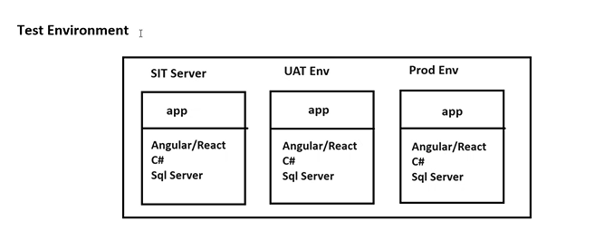
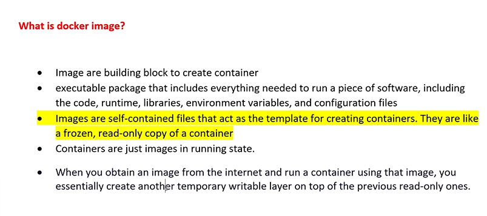
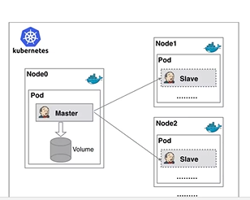
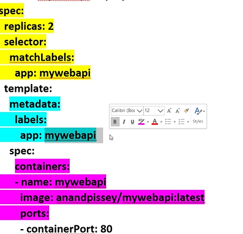
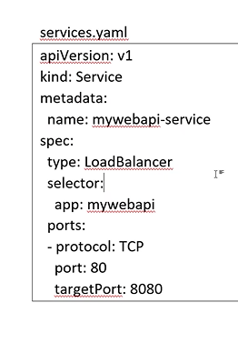

# INTRODUCTION

- it is a platform which allows developers to automate deployment process


### TESTING


- SIT -> system integration testing ( integration testing)

- UAT -> user acceptance testing (done in client's environment, i.e the client team tests the application) -> devops are responsible

- Production ENvironment -> where actual software run

- unit testing -> testing individual methods ( done by developers)
- integration testing -> combining all parts to single unit and then test the applications (done by deveoplers)
- load testing -> testing the number of users it supports at a time
- Performance testing -> time taken to display the results


#### PROBLEMS THAT MIGHT CAUSE IN DEPLOYMENT(the code might not run in users system)

1. different settings in OS
2. required dependency missing
3. not having rigth version of API's
4. not having the right environment


- hence docker is introduced

- Docker creates an environment where an application can run anywhere irrespective of platform

- docker is a containerization software -> all the configurations, packages ,settings required along with the software is inside the contianer -> this container is delivered to user

- to simplfy deploymnet process

- docker will take care of required dependencies of our application

#### WHAT IS A CONTAINER? 

- the process of packing our application code + dependencies as a single unit and executing as a container is called as containerization 

- container is a VM(linux)


- enable WSL,container and hyperV for docker 

## WHAT DOCKER CONSISTS OF

1. Container: read/write working copy , it will have all the required dependencies

- container will have the dependencies based on the docker file

how to create container -> always  created from images

2. image: images are created from docker file

- docker file contains all configurations and dependency settings which is required to run the application

- create a docker file where the project is running, the name of the file should be docker

- tells that .net 8.0 runtime has to be installed ( docker file contains the checklist) , list of libraries required, the port number to be used to run the apllication , list of commands to be executed while installing to docker desktop.

- based upon this checklist image is created 

- image are read only

- image is like class and container is like object

- one image can have many containers 



3. Docker repository: online storage , where all the images are stored

4. Docker Command : 
     - docker start : starts the docker server 
     - docker stop : stop the docker server
     - docker push : push to online repository
     - docker pull : pull from online repository
     - docker run : executes the container


- docker desktop contains all the images and containers stored locally

- docker daemon -> like dserver where the images are stored


## STEPS TO CREATE IMAGE AND CONTAINER

1. create a docker file in the same folder in which you have project files . To create for project MyWebApi

```c#
# Use the official ASP.NET Core runtime as a parent image
FROM mcr.microsoft.com/dotnet/aspnet:8.0 AS base
 WORKDIR /app
  #folder inside docker where the project will be running 👆
EXPOSE 8080 
# the port number in docker where application will run
 
# Use the official ASP.NET Core SDK image to build the app
FROM mcr.microsoft.com/dotnet/sdk:8.0 AS build
WORKDIR /src
# copies the project MyWebApi.csproj to MyWebApi
COPY ["MyWebApi.csproj", "MyWebApi/"]
# copies all required dependencies ,libraries 
RUN dotnet restore "MyWebApi/MyWebApi.csproj"
WORKDIR "/src/MyWebApi"
COPY . .
 
RUN dotnet build "MyWebApi.csproj" -c Release -o /app/build
 
FROM build AS publish
# creates a image
RUN dotnet publish "MyWebApi.csproj" -c Release -o /app/publish
 
# Use the base image to run the app
FROM base AS final
WORKDIR /app
COPY --from=publish /app/publish .
ENTRYPOINT ["dotnet", "MyWebApi.dll"]

```

2. Add the code in launchsettings.json 

```c#
"Docker": {
    "commandName": "Docker",
    "launchBrowser": true,
    "httpPort": 8000,
    "useSSL": true,
    "sslPort": 8001,
    "environmentVariables": {
      "ASPNETCORE_ENVIRONMENT": "Development"
    }
  },
 
```

3. build the image with name mywebapi in the path of the project file

```c#
docker build -t mywebapi . 

```

4. create container , give unique port number for every container
```c#
docker run -d -p 8080:8080 --name mywebapi-container mywebapi

```

5. to run the proj

```c#
curl http://localhost:8080/weatherforecast
//or
//from browser 
http://localhost:8080/weather/forecast
```

5. to push to docker hub (username -> akshita1234 and iamge name mywebapi)

```c#
docker tag mywebapi akshita1234/mywebapi:latest
docker push akshita1234/mywebapi:latest
```

6. to pull and run someone's proj
```c#
docker pull akhila0307/empolyee:latest  
docker run -d -p 8090:8080 --name container1  akhila0307/empolyee
```


# KUBERNATES (K8S)

- kuburnetes is an orchestration platform


- the primary job of kubernets is to manage and monitor the container, same way the center person handles other musicians

- open source

- developed by google 

## WHY KUBERNATES

- if the number of users increases, single container wont be sufficient

- additional container would require to adjust number of users

- if users decrease we need to decrease the conatienrs to save resources

- writing commands would be difficult to maange 100's of containers

- kurbernetes is used to make these things automatically

- provides framework to handle container (deployment,scaling,load balancing etc..)


## ADVANTAGES

1. COntainer orchestration -> how many containers are running , when container was created , since how long anf port number
2. Auto Scaling
3. Self healing ( if one container crashes then new container is created)
4. Load balancing ( uses all containers without keeping any container ideal)


- all commands start with Kubectl

- to work with kubernetes make sure the proj is pushed to repository


## TERMS 
- all this happens inside a cluster(a group of physical or virtual machine) -> all the group of systems where the containers are created


- all nodes are different systems or virtual machines

- a cluster is made of one master node and many worker nodes

1. Master node : manages all worker nodes (takes care of autoscaling,laodbalancing and self healing )

2. Worker Node

3. Pod : creates pods instead of containers as it handles with all types of containers not only docker containers
- Kubernates runs one or more containers inside pods

- pod contains all the containers of a project

4. Volume -> it is like a small database, so that when a container is crashes , a new container can get all the files from volume.


- to work with kubernetes two file have to be created

1.  deployment.yaml (yet another markup language) -> manages scaling   of pods 

    - Apiversion -> the api version 
    - kind
    - spec : number of replicas of pods , and app has the name of the pod  mywenapi
    


2. services.yaml - has network level information, port numbers of port , system details. Used for laodbalancing

 


- deployment of these files

```c#
kubectl apply -f deployment.yaml
kubectl apply -f service.yaml
```

- to get number of pods running and services

```c#
kubectl get pods
kubectl get services
```


- to create cluster : minikube is a tool that allows to run single node K8s cluster on your local machine

```c#
minikube start
```


- to scale the replicas (the name of the deploment is the deployment.yaml file)

```c#
kubectl scale deploy mywebapi-deployment  --replicas=5         
```

- the pod can be deleted by getting the pod name from get pods command
```c#
kubectl get pods
kubectl delete pods mywebapi-deployme
nt-6dc658b84f-bvcs7
```


- to run the container using kubernetes, using 127.0.0.1 
```c#
curl http://127.0.0.1:8081/weatherfor
ecast
```

- 
 