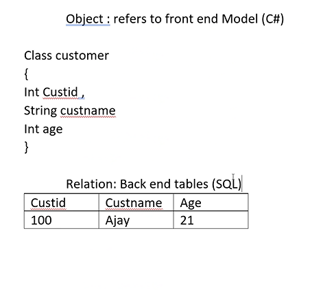

# INTRODUCTION

- EF is used in C# to interact with database
 
 - When .NET was introduced , Ado.Net(activex data object) was used for interaction

 - Ado.Net have many classes to connect with database
 1. sqlconnection
 2. SqlCommand
 3. Datareader
 4. Datarow
 5. SqlAdaptor
 6. Dataset
 7. DataView
 8. Datatable
 9. SqlParameter

 - Whats Wrong with Ado.net?
 1. too many classes to work -> confuses developer what class to use . Entity framework uses only one class

 2. simple piece of interaction requires very lengthy code.

 3. manually requires to manage connection, whereas in entity it is automatic

 4. not type safe - causes error at runtime

 5. does not follow oops way to interact with databaze

6. difficult to master


- WHAT IS ENTITY FRAMEWORK

1. improved version of ado.net
2. gives developes an automated way to store and access databases.
3. bridges gap b/w oop and adatabase programming
4. ORM(Object Relation Mapping) framework that allows you to easily create and coonect to databse

     - object - refrs to frontend model (replica of table, classes having its own properties) - in C#
     - Relation - backend structure , always in sql databse
     - Mapping - convertor




## HOW EF WORKS?

- EF converts backend tables to classes and properties automatically
- Ef will convert all LINQ queries to corresponding SQL Queries automatically


- mapping - maps the properties to column names of sql (i.e the property custid of a class is mapped to column name custid in sql)

- when we connect to database using entity framework, a xml file called app.config is created


### VALIDATION 

- import namespace 
```c#
System.ComponentModel.DataAnnotations
```

- attribute -> can be attached above the class or properties
- Validation is given through attributes


- Required -> compulsory to enter
- MinLength -> min length of characters required
- Range -> takes the value that in the range
- Regular Expression -> for eg : country code while entering phone number


```c#
//class of the table in sql
    public partial class employee
    {
        [Required(ErrorMessage ="pls enter empid")]
        public string empid { get; set; }

        [Required(ErrorMessage ="pls enter empname")]
        [MinLength(3,ErrorMessage ="min length is 3 character long empname")]
        [RegularExpression("$[a-z]+^",ErrorMessage="only aplhabets required")]
        public string empname { get; set; }

        [MinLength(4,ErrorMessage ="min length is 4 character long")]
        public string designation { get; set; }

        [Range(10000,200000,ErrorMessage ="invalid range")]
        [Required(ErrorMessage ="salary field is required")]
        public Nullable<int> salary { get; set; }
    }


      //usage to add employee
        public void AddNewEmp()
        {
            try
            {
                employee e1 = new employee();
                e1.empid = Console.ReadLine();
                e1.empname = Console.ReadLine();
                e1.designation = Console.ReadLine();
                e1.salary = int.Parse(Console.ReadLine());

                dc.employees.Add(e1);

                //to change to database
                int i = dc.SaveChanges();
                Console.WriteLine("total rows inserted is " + i);
            }
            catch (Exception ex)
            {
                var r=dc.GetValidationErrors();
                foreach (var e in r) // the e here is the errors of each field
                {
                    foreach (var t in e.ValidationErrors) //to print each error of the field
                    Console.WriteLine(t.ErrorMessage);
                }

            }
        }

```