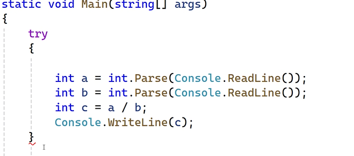
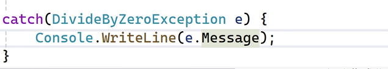
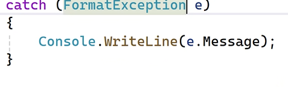
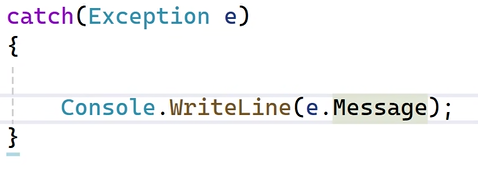
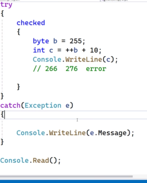

# GENERICS

- Collection of related elements(objects)

#### DRAWBACKS OF ARRAY
- size is fixed
- dynamic insertion and deletion not possible
- does not support sorting and filtering(inbuilt function not available)
- does not supports LIFO and FIFO storage


#### GENERICS 
- size is not fixed
- dynamic insertion supported
- sorting inbuilt function available
- LIFO and FIFO 


- import class to use generics
```cs
System.collections.generics
```
Contains classes
1. List
2. Dictionary
3. SortedList
4. Stack
5. Queue
6. Custom class/methods

#### LIST
```cs
List<DataType> l1 = new List<dataType>();
l1.Add(10); //appends at last
l1.Insert(2,43); // to insert dynamically  at position 2


l1.Remove(43); // removes a particular element 
l1.RemoveAll(x=> x==43); // to remove all  elements having value 43
l1.RemoveAt(2); //remove at a index
l1.RemoveRange(2,5); //Range of index 
l1.RemoveAll(); //removes all values
List<DataType> l2 = new List<dataType>(){10,20,30};

//print
Console.WriteLine(l1[0]);

//length
Console.WriteLine(ob.Count); //count is a property

//how to sort data
l2.Sort();

l2.Reverse(); //to sort in descending order


Console.WriteLine(li.Capacity); //allocates memory beforehand
// for zero -> 0
//for one -> 4 (allocates memory for four elements)
// then doubles -> 8
// then 16
li.TrimExcess(); // to remove the unused memory
```


- Custom Class -> to store more than one datatype
```cs
public class Products
{
    public int ProductId { get; set; }
    public string ProName { get; set; }
}

//method
public void demo2()
{
    List<Products> li = new List<Products>();

    Products p1 = new Products();
    p1.ProductId = 1;
    p1.ProName = "Shoes";

    li.Add(p1);

    foreach (var p in li)
    {
        Console.WriteLine(p.ProductId);
    }

    //to print only product 1
    Products reult = li[0];
    Console.WriteLine(reult.ProductId+" "+reult.ProName);

    //Collection intializer method
    List<Products> l1 = new List<Products>(){
        new Products(){ProductId=1,ProName="Shoes"},
        new Products(){ProductId=2,ProName="Shirt"}
    }
}

```

- List class is similar to array , where in items are accessed using index position 

#### DICTIONARY
 
- items are access using key instead of index position 

```cs
Dictionary<int,string> d = new Dictionary<int,string>();
d.Add(100,"India");
d.Add(200,"Canada");

Console.WriteLine(d[200]);
SortedList<int,string> s = new SortedList<int,string>(d); // to sort acc to key 
foreach(var item in s){
    Console.WriteLine(item.Key+" :"+item.value);
}
```


#### STACK
- LIFO - last items are shown first
- Real Time Examples
1. Browser History

```cs
Stack<string> s = new Stack<string>();
s.push("http://facebook.com");
s.push("http://google.com");
s.push("http://youtube.com");

foreach(var item in s){
    COnsole.WriteLine(item);
}

Console.WriteLine(s.Count);
Console.WriteLine(s.Pop()); //prints and remove the top element
Console.WriteLine(s.Peek()); //prints the top element
```


#### QUEUE

- items are arranged in FIFO ( first in first out)
- Real Time example
1. Bank token 
2. Reservation


```cs
Queue<string> s = new Queue<string>();
s.Enqueue("Akshita"); //push
s.Enqueue("Riya");
Console.WriteLine(s.Count);
COnsole.WriteLine(s.Peek()); // Akshita
Console.WriteLine(s.Dequeue());

foreach(item in s){
    Console.WriteLine(item);
}
```


#### CUSTOM CLASS/METHODS

```cs
public void swap<T>(T a, T b){
    T c=a;
    a=b;
    b=c;
    Console.WriteLine(a);
    Console.WriteLine(b);
}

//in main
Demo d1=new Demo();
d1.swap<int>(30,56);
d1.swap<string>("hi","welcome");
```

- generic class
```cs
internal class GenDemo<T>{

}
GenDemo<int> ob = new GenDemo();
ob.swap(1,2);
```


# EXCEPTION HANDLING

- to handle run time errors

- Type of errors 
1. Compile (won't run)
2. Logic (compile succesfully , but output is not as expected)
3. Run (compiles succesfully but doesn't run )
  Eg: array Size (out of bound ), wrong data type given as input , file not found error, memory exception 

- try and catch 




DivideByZero is the exection name that occurs when divided by 0.


for exception if we enter other data type as input



instead of giving each exception, we can use exception as class 


- finally always run whether there is a error or not
- to close the resources
```cs
finally{
    Console.WriteLine("finally block called");
}
```

- if the limit exceeds for the data type it becomes zero.

- checked => used to know error if any in data type



- Custom Exception 

```cs
class AgeException:applicationException //to use message class
{
    //constructor
    public AgeException(string message) : base(message){

    }
}

internal class ageexdemo{
    public void display(){
        try{
            int i = int.Parse(Console.ReadLine());
            if(i<18)
              throw new AgeException("Min Age should be 18")
        }
        catch(AgeException ex)
       {
         Console.WriteLine(ex.Message);
       }
    }
}

```

# STREAMS(File Handling)

- Real Time Examples
1. logging error
2. serialization
3. to store offline copy data

-  import -> System.IO

  classes -> 
  1. FileStream (to create a file)
  ```cs
  FileStream fs = new FileStream("E:\\proclink\\hello.txt",FileMode.OpenorCreate, FileAccess.ReadWrite);
  ```
  2. FileInfo (information about file)
  3. StreamReader (Content of the file)
  ```cs
  StreamReader sr = new StreamReader(fs);
  string str = sr.ReadToEnd();
  Console.WriteLine(str);


  4. StreamWriter (Write content to file) 
  ```cs
  StreamWriter sw = new StreamWriter(fs);
  sw.WriteLine("Helloooo");
  sw.Close(); // if not closed others cannot access
  fs.Dispose();
  ```
  5. BinaryWriter ( write content in binary format)
  6. BinaryReader ( read data from binary file)
  7. Directory ( create a folder)
  
  ```cs
  Directory.CreateDirectory(C:\\Dot Net\\mydir);
  ```

  8. DirectoryInfo (get info about folder (name, no of files data/time , path))

  ```cs
  DirectoryInfo d = new Directory("C:\\Dot Net\\mydir");
  Console.WriteLine(d.FullName);
  Console.WriteLine(d.Parent);
  Console.WriteLine(d.CreationTime);
  ```

# SERIALIZATION

- is a process of converting an object to a stream / filesystem/network transferable

- in simple converting object to a file
- after sharing we have to deserialize 
- Deserialize -> convert file to object

- Types 
1. Binary - data is stored in binary format( the file will be in binary)
2. Soap - simple object access protocol -> protocol that carries data in xml.
3. xml - data is stored in xml 
4. json - data is stored in json

- import -> System.Runtime.Serialization.Formatters.Binary;


```cs
public void SerializeDemo1()
{
     List<string> list = new List<string>()
     {
         "india","canada","swiz","us"
     };
 
     FileStream fs = new FileStream("E:\\proclink\\country.bin", FileMode.OpenOrCreate, FileAccess.ReadWrite); //bin for binary , xml for soap
 
     BinaryFormatter bf = new BinaryFormatter();
 
     bf.Serialize(fs, list);
     fs.Dispose();
     Console.WriteLine( "created successfully");
 
}
 
 
public void deserialize()
{
     List<string> s = new List<string>();
     FileStream fs = new FileStream("E:\\proclink\\country.bin", FileMode.OpenOrCreate, FileAccess.ReadWrite);
 
     BinaryFormatter bf = new BinaryFormatter();
 
    s = (List<string>)  bf.Deserialize(fs);
 
     foreach (var item in s)
     {
         Console.WriteLine(item );
     }
     fs.Dispose();
 
}

```


- Uses of binary serialization 
1. for transferring sensitive data
2. only meant to communicate between same type of operating system.

- soap serialization
1. works on different platforms , languages