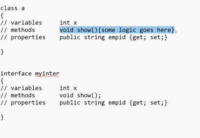
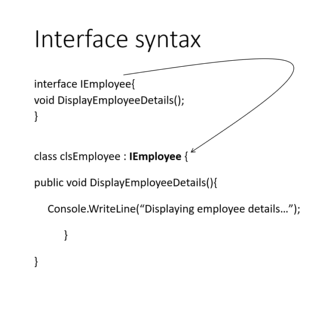
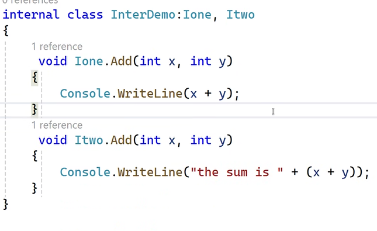
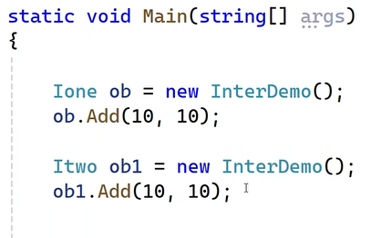

# INTERFACE

- same as class but no implementation
- has varaibles,methods,properties

- only declaration
- in  C# variables not supported in interface
- implementation is handled using class



- access specifiers are not allowed in interface

- Advantages:

1. Maintains standardization : proper naming conventions, it will force the class to use the signature used in the interface

2. show only the relevant methods.

```cs
Idbinter ob = new InterfaceDemo(); //Idbinter is interface name and InterfaceDemo is class name
// This means we can only use the methods of Idbinter interface
```

3. common method signature
- we can methods with same name and signatures in a class using interface




