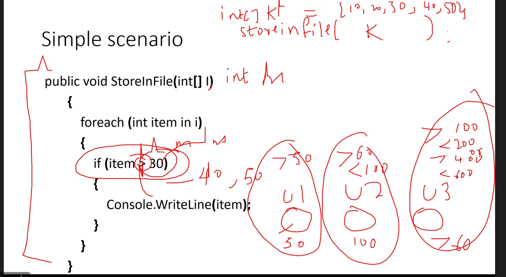
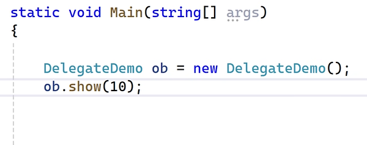
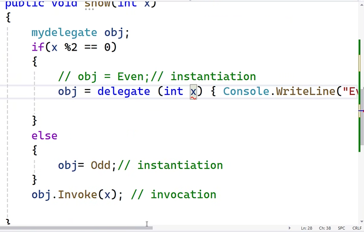
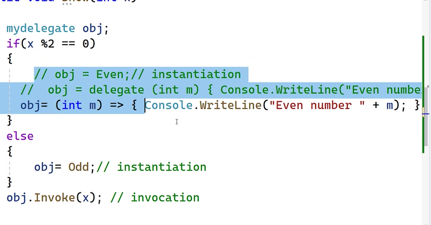

# INTERFACE

- same as class but no implementation
- has varaibles,methods,properties

- only declaration
- in  C# variables not supported in interface
- implementation is handled using class
- access specifiers cannot be used


- access specifiers are not allowed in interface

- Advantages:

1. Maintains standardization : proper naming conventions, it will force the class to use the signature used in the interface

2. show only the relevant methods.

```cs
Idbinter ob = new InterfaceDemo(); //Idbinter is interface name and InterfaceDemo is class name
// This means we can only use the methods of Idbinter interface
```

3. common method signature
- we can methods with same name and signatures in a class using interface


# DELEGATES 

- function pointers

- is a method without any logic
```cs
public delegate void show();
public void hello()
{
}
show obj = hello
```
- this method can point to another method with same signature
- if delegate is invoked the method is called
- invoke function is inbuilt 
```cs
obj.invoke();
```

- calling this way makes application logic independent





- if parameters needed , invoke must also contain parameters


- if only one line of code no need of methods



- even more easier using lambda expression 
