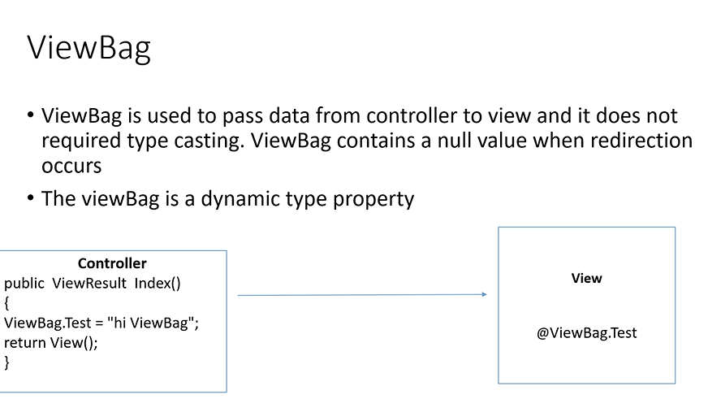

# INTRODUCTION

- In razor pages each page has its own logic
- UI is created using HTML (Textbox , button , images)
- cs page (logic) 
- Context.cs page & Model file -> created automatically whenever database is connected

- MVC has architectural pattern, separates an application into three main components .

- We have to import namespace Microsoft.

## MVC (MODEL,VIEW,CONTROLLER)

- We have three folders in every MVC project ->  Models, Views , Contollers.

- View Folder has all UI files (.cshtml or html)
      - In home -> index.cshtml and privacy.cshtml (by default)
      - viewImports -> contains all the namesapce
      - viewStart -> contains layouts

- Model Folder  represents data files -> contxt and model files(contains classes and public properties) 

-  Controller Folder -> to write queries (.cs file). In razor pages we have multiple .cs files for each page, in MVC we have a single .cs file for all pages.

- This division into folders in mvc was done for isolation , suppose we want to change our database from sql to oracle , the other folder should be independent , should not be effected.


- The UI page cannot be called directly (.cshtml/html)
```c#
https://localhost/test/hello.html ❌
```
- contoller handles users requests

- Controller handles the view and model file 

- controller decides what ui the user wants

- view cannot interact with model directly

- All names of controller files should end with .Contoller

- the data will be requested by controller to model, model will give the data, then contoller stores the data in view

 #### OTHER FOLDERS

- App_Data folder contains xml and json files (temporary data).

- App_Start -> contains logic for authentication , filtering, routing (.cs file)

- COntent -> bootstrap , css files , style related files

- Scripts -> javascript files

- Fonts -> font files 

- When we create a contoller class under controller, it inherits a base class called cntoller

- In mvc whatever the method returns will be displayed in browser

- url in mvc
```c#
http://localhost/contollername/methodname
```


- use return type as ContentResult to apply html

```cs
public ContentResult proclink()
{
    return Content("<b><font color = red>Hello proclink</font></b>", "text/html");
}
```


- to add a view to a method in controller -> right click inside the method and add view with same name as method
- the return type must be view in the methods

```cs
 public ViewResult showDate()
 {
     return View();

 }
 ```


 - to add a anchor tag in view 
 ```c#
 <a asp-controller="Home" asp-action="Index">Index Page</a>
 ```


 ### ACTION METHODS

 - must be public 
 - cannot be overloaded (with same name)
 - method must not be static

 


 ## PASSING DATA FROM CONTROLLER TO VIEW

 - three options 

 1. ViewData -> 
 
 - after redirecting it becomes null -> we cannot display this viewdisplay in some other method 
 - data stored is object type

 2. ViewBag -> 
 
 - assigns data type based on the data 

 3. TempData -> 

 

 - use TempData.keep("t"); -> to keep the data to be used in other methods

 - use the keep method in all methods from which we go to next page and want the value of tempdata


- helper function -> need not repeat code again and again

```c#

@{
    void hello(string[] data)
    {
        foreach(var item in data)
        {
            <li>@item</li>
        }
        <hr/>

    }


}

@{
    hello((string[])ViewData["co"]);
    hello(ViewBag.c);

}
```


### ACTION SELECTORS

- attribute  
- applied to action methods
- three selector attributes
1. ActionName -> allows to specify diff action name other than method name

eg: write above method 
[ActionName("find)]

- if the return type is view it will cause error as method name and view name are same , it will call the view with alias name given thriugh actio name 

to resolve
```c#
return View("showDate");// give the method name in VIew()
```


2. NonAction

- whenever methods are created in controller, the method can be accessed from the browser

- the methods which we dont want to be called from the browser use non action attribute

```c#
[NonAction]
public string india(){

}
```


3. ActionVerbs
- get executed when the page is loaded for first time
- post -> whenever submit button is pressed  , post is invoked

- used as  HttpGET + HttpPOST

- if no key word used by default it is get
- when the url is loaded get is called


```cs
public ViewResult Addnums(){
    return View();
}

```

- post 
```c#
//read the vlaue of text box
// give the same names of text boxes as parameters
[HttpPost]
public ViewResult Addnums(string txt1,string txt2){

    int res = int.Parse(txt1)+int.Parse(txt2)
    ViewData["v"]=res;
    return View()
}
```


- IActionResult -> return type , can return anything (view , js ,string,....)


- to check if all validations are true and add the record inly if
```c#
 public IActionResult Register(Register r)
 {
     //ModelState.IsValid is true only if all validations are true
     if (ModelState.IsValid)
     {
         dc.Registers.Add(r);
         
     }
     int i = dc.SaveChanges();

     if (i > 0)
     {
         ViewData["msg"] = "New User Created Successfully";
     }
     else
     {
         ViewData["msg"] = "Could Not Create User Successfully Try Again!!";
     }
     return View();

 }
 ```


 - this will be available in all methods. Overcomes the rrestrictions on VIEwDATA , VIEWBAG , TEmoData

 ```c#
         HttpContext.Session.SetString("abc","hello")
         var k = HttpContext.Session.GetString("abc")
```

- we can pass the variable in return View() also to view page and use Model to use the variable in view variable


- Validations can be inserted abouve property names 
Eg: [Required(ErrorMesssage="")] -> mandatarory field
[MinLength(5,ErrorMessage="")]

- We can also use custom validation 

```c#

    public class CheckDOB:ValidationAttribute // we can errormessage using this class
    {

        public override bool IsValid(object? value)
        {
            DateTime dt = (DateTime)value;

            if (dt < DateTime.Now)
            {
                return true;
            }
            else
            {
                return false;

            }
            
        }
    }


    [CheckDOB(ErrorMessage ="")] //validation
```


### PARTIAL VIEW

- also called as reusable views
- in partial view we can create a UI and reuse across multiple pages
- are created using partialviewresult return type instead of actionresult.

- partial view is merged with complete view

- suppose we want to use code written in partial view of test Partial


### ACTION FILTERS

- a set of logic which is applied before or after calling action methods

- we can execute certain logic before the method starts executes 

- Types

1. Outputcache
2. Exception
3. Authentication 


#### What is outputcache : 
1. all action filters comes in form of attributes. 
2. Allows to store frequently accessed data in cache memory in order to increase application performance .  
3. Using output cache the page guarantees to run faster
4. apply for methods that are large


- date will be stored in cache for 10 s after that method will be executed again and the value will be stored in cache.


- to use this add in program.cs
```c#
builder.Services.AddOutputCache();
app.UseOutputCache();
```


#### What is Exception :
1. using exception filter we can display custom view page when run time error is encountered

to add exception to entire project, in Program.cs

```c#
builder.Services.AddControllersWithViews(c=>c.Filters.Add(new CustomExceptionFilterAttribute()));
```

- to apply for a particular method

```c#
public class CustomExceptionFilterAttribute : ExceptionFilterAttribute
    {
        public override void OnException(ExceptionContext context)
        {                     
            context.Result = new ViewResult { ViewName = "Error" };
            context.ExceptionHandled = true;
        }
    }
```

Now apply the class name as attribute on top of method, if you want for entire class place the attribute on top of class.

- to use exception we need to first create a class which inherits ExceptionFIlterAttribute and override the onexception method 

- in onexception you need to specify the viewname and ExceptionHandled property 


#### What is Authentication

- .Net supports many kind of authentication 

1. Cookie based authentication : we use collection of claims and identities to handle this. We also use cookie file(text file) in this type

2. JWT authentication : json web token . THis type of authentication is very widely used in web API.

3. OAuth authentication : in this type of authentication ,we use external website to get user information, instead of managing users manually. Eg: we use sign in by google account in other websites.


###### COOKIE BASED AUTHENTICATION 

1. claims
2. claim identity
3. claim principle

- claims are information regarding particular object or person 
- claims always come in the form of key value based
Eg:
varun => identity
age:21  --claims
address:hyd --claims
phone:234543423  --claims

- claim identity is collection of one or more claims 

Eg: votercard(claim identity)
    claims
    1. voterid : 23435
    2. name : akshita
    3. dob : 220202
    4. address : hyd

- claim principle is collection of one or more identities


