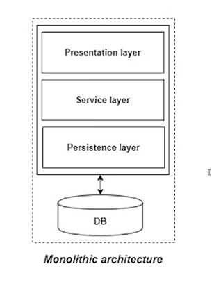
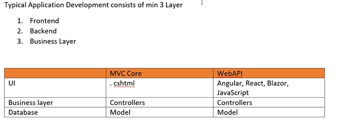
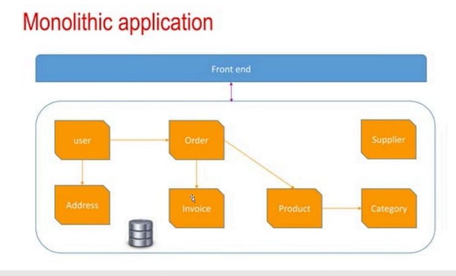
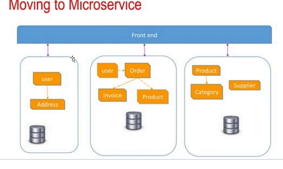
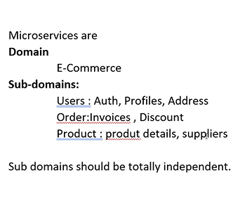
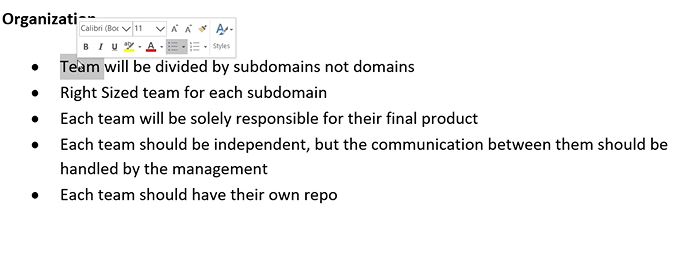
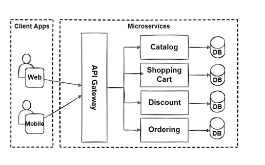
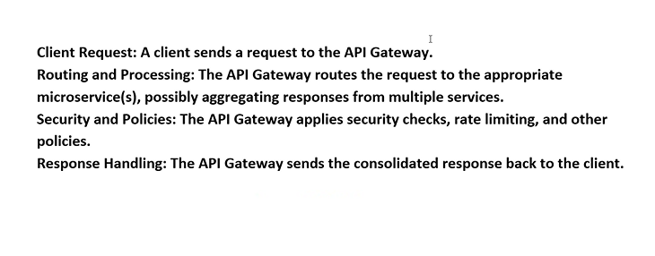

# MICROSERVICES

- service -> set of actions

- microservices -> divide the service (project) into smaller parts ( each part is part of project)

### MONOLITHIC APPLICATION



- persistent layer -> database  (Model,context pages)
- presentation layer -> UI
- service layer -> backend (Controller)

- if application is not micro services then it is monolothic 




- single deployment -> to make the application online

- single runtime -> single language is used 

- single database -> sql server

- interaction between classes is most often synchronous

- each layer is separated with packages/libraries 




- single frontend , many controllers and a single database 


- benefits

1. simple to build
2. simple test
3. simple deploy and develop


- Drawbacks

1. start of app will take long time  -> executes all the controllers
2. new team members difficult to understand the project complexity
3. bigger the bigger the team 
4. cannot update with new technology (since single kanguage is allowed)
5. need more CPUs
6. no flexibility ( one layer effects the other)
7. longer development lifecycle
8. maintenance is difficult 
9. fault tolerance brings down entire application


### MICROSERVICES


-  advantages
1. many module with specific functionality
2. each microservice with separate deployment
3. each microservice has its own db
4. module independence
5. more than one technology
6. easy to manage
7. avoid fault tolerance
8. decentralized 






- can use sync and asyncronous 
- rest/soap can be used
- different APIs can be used for diff microservices
- request/response principle
- remote procedural call (netwrok based applications)


- to communicate between different microservices rabbitmq is used
- many urls (each url for each module)


- architecture




- to avoid using multiple urls , api gateway is used 
- api gateway -> nothing but one more web api -> used to link other web apis.


- Benefits of using api gateway
1. simplified client interface
2. improved security -> code for all microservices can be written in api gateway
3. reduced nwtwork traffic -> only specific contollers are laoded
4. everything is centralized 
5. decoupling clients and services -> clients are decoupled from the inernal structure of microservice.


- create a json file in api gateway to connect all web api
```json
{
  "Routes": [
    {
      "DownstreamPathTemplate": "/api/Students/showstudents", //the path of the file
      "DownstreamScheme": "https",
      "DownstreamHostAndPorts": [
        {
          "Host": "localhost", //both are in the same system so local host
          "Port": 7258
        }
      ],
      "UpstreamPathTemplate": "/apigateway/students",
      "UpstreamHttpMethod": [ "GET", "PUT", "POST" ] //the user can connect to get,put,post methods
    },
    {
      "DownstreamPathTemplate": "/api/Teacher/showTeachers",
      "DownstreamScheme": "https",
      "DownstreamHostAndPorts": [
        {
          "Host": "localhost",
          "Port": 7057
        }
      ],
      "UpstreamPathTemplate": "/apigateway/teachers",  // the path the user will type which should connect to downstream where the microservice is running
      "UpstreamHttpMethod": [ "GET", "PUT", "POST" ]
    }
  ]
}
```

- now using the https url of api gateway from launch settings we can run both projects using same url 