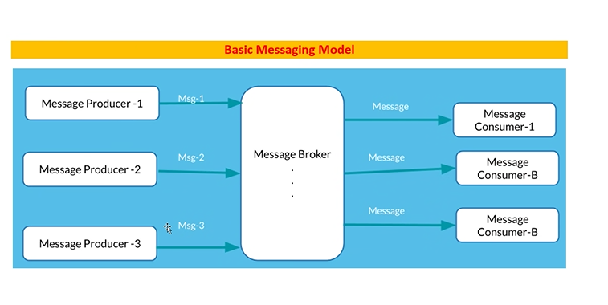
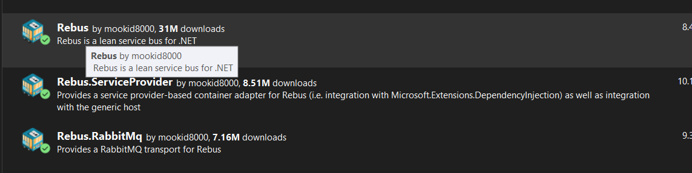

# INTRODUCTION

- MQ-> message queue
- introduced by morzilla
- written in erlang language
- TO AVOID FAULT TOLERANCE -> ability to work properly even in the presence of failures 


 
- AMQP is followed (Advanced message queuing protocol)



- in queues the  msgs are stored in byte format


- URL FOR RABBITMQ

locaLhost:15672

### STEPS

1. downlaod rabbitmq.client package
2. create a class rabbitservice -> job of this file is to send messages stored in queue
3. import namespace RabbitMQ.Client in the class -> gives two interfaces IConnection and IModel interface 


- Automatic way:

1. dowload the packages



2. 
```c#
public class MyMessage
{
    public string Text { get; set; }
}
```

3. create a class
```c#

        public class MyMessageHandler : IHandleMessages<MyMessage>
        {
            public Task Handle(MyMessage message)
            {
                Console.WriteLine("Received message: {0}", message.Text);
                return Task.CompletedTask;
            }
        }
```


3. 
```c#

private readonly IBus _bus;
 
public RabbitMQController(IBus bus)

{

     _bus = bus;

}
 
[HttpPost("send")]

public async Task<IActionResult> SendMessage([FromBody] MyMessage message)

{

     await _bus.Send(message);

     return Ok("Message sent to RabbitMQ");

}
 

 ```

4. in program.cs 
```c#
builder.Services.AddRebus(configure => configure
.Transport(t => t.UseRabbitMq("amqp://localhost", "rebus_queue"))//where you want to store the queue and the queue name
.Logging(l => l.Console()).Routing(r => r.TypeBased().Map<MyMessage>("rebus_queue")));


builder.Services.AutoRegisterHandlersFromAssemblyOf<MyMessageHandler>();

```


