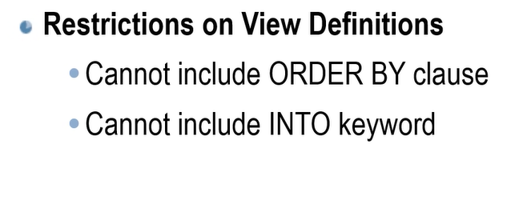

# SERVER TYPE

- Integration Services : for moving data from one server to another (sql,oracle)

- Reporting Services : has option of generating charts,PDFs

- Azure SSIS Integration Runtime : to connect to cloud 

- Database Engine : to store data 


# SERVER NAME 
- to connect with any system databse

# BUILT IN DATABASES
1. master : stores authentication ,credentials , security related database , permisssion of objects.

2. model
```sql
sp_help -- to get all tables,procedures,view
sp_help tablename --to get details of table
sp_rename oldname , newname --to rename table
sp_helpdb  --gives all databases
sp_helpdb slk --it gives information about specific database


EXEC sp_dboption 'sales','offline','TRUE'
```

- two files get created whenever we create a database -mdf files (all the tables created are stored, pysically stores) and ldf files(transaction information)

- when we rollback the information gets restored, it comes from ldf files


- the built in procedures are stored in model database


3. msdb : stores jobs and alerts(notifications)
what alerts , at what time the alert should occur all these are stores. Jobs , the queries are not executed immediately , they are scheduled and executed automatically.

4. tempdb : the tables created are temporary , once the server is restarted , the tables are lost. Sorting (when we sort , to rearrange the rows tempdb is used) and groupby.


- when we create a database -> the intial size is 16MB .
- to create a databse of our own size

FileGrowth -> when the size is full , it increases by 20% 
- the log file should be atleast 30% of database size

- alter the database


- we can run sql in command prompt


   -  -E -> to use windows authentication
   - -S -> server name
   - -d -> databse name


# TYPES OF QUERIES

- dml => data manipulation language (insert , update, delete)

- ddl : data defination language (create, drop , alter)

- tcl : transaction control lang (commit , rollback)

- dql : data query lang (select)

- dcl : data control lang (grant , revoke)


- unique identifier -> unique for entire sql


# DATA TYPES 
- binary -> data is encrypted 


## CROSS JOIN


## VIEWS



```sql
 sp_helptext viewname => gives source code 
```


- if the view is encrypted , we cannot view the source code using sp_helptext.
- also applicable to procedure 👆


```sql
sp_depends tablename  -- for table 
sp_depends viewnmae -- for view
```
- to check whther any views exist using this table name(when we drop the table  view will cause error when executed)


- we can  only insertvalues with address as chennai as we used check constraint.


- in schema binding we can use * in select statement and table names must be in two name format - dbo.customers


## PROCEDURES


```sql
sp_helptext sp_help -- gives the source code of sp_help
```

##### Befinits of procedures
1. makes application loosely coupled - changes in database wont effect c# code

- tightly coupled -> when we make changes in th database we have to make changes in c# too

 

2. Security mehanism - can hide table information 

3. Improve Performance - every time we call a procedure the code need not be compiled as it is already compiled

4. reduce network traffic: reduces the number of lines of code 


- whatever the procedure employeeCustomer procedure returns , will be inserted into customer table


- to return more than one value in a procedure we can use output keyword


- the values returned by procedure are mapped to variables m and n


### ERROR HANDLING

##### @@error

- @@error => system defined variable
```sql
if(@@error=8134) -- 8134 is the error number
print 'Please do not pass zero as a parameter'
else
print @result
```
```sql
-- these all can be used in try catch block
error_number()
error_line()
error_message() 
```


#### FUNCTIONS
- procedures cannot be part of the query, whereas functions can be part of query

- function are mostly for mathematical operations

- procedure may or may not return a value , function has to return a value 

- use dbo. as prefix to function name as without dbo it will consider as built in function

### TRIGGERS

- associated with table
- invoke automatically
- cannot be called directly
- mostly is part of a transaction

- triggers are reactive ( the record will be validated after insert,if failed it will rollback), cosntraints are proactive (the record will be validated then inserted)

- Constraints are checked first 

```sql
@@ROWCOUNT -- number of rows effected
```


-  the deleted and inserted tables are stored in ldf files.

-

- if rollback not used , it commits by default whether condition is satisfied or not in triggers.