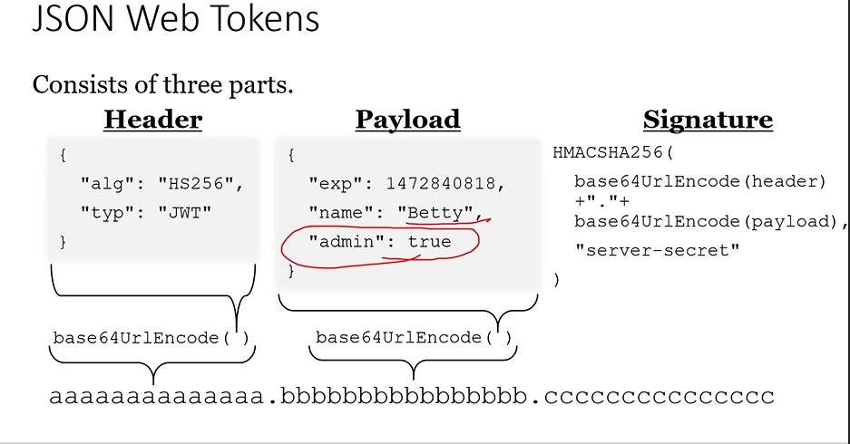

# INTRODUCTION

## INTRODUCTION TO DISTRIBUTED COMPUTING

- components of software system are shared among multiple computers(Nodes or servers) to improve efficiency and performanace .

- These softwares work together to perform a particular task.

- components of software -> UI , Business Logic (Controllers , classes) , Database. 

- single point failure can be avoided.

- Power of multiple systems (RAM, Harddisk)

- load balancing

- distributed -> the network can be same or different 


-  these three components together make a server

- the three components can be connected in three ways

1. Remoting -> limited to framework (only .NET clients can communicate) and for only windows 
- supports binary format

- set of classes created by microsoft to make our logic global and generates a url for others to use.


2. Web Services -> any url with asmx is a web service

- supports xml format

- any client can access services irrespective of platform

- converting remote architecture to web services was not easy , hence wcf was intoduced

3. WCF(WINDOWS COMMUNICATION FOUNDATION) 

- collection of many technologies (Eg: Web services, Remoting)

- conversion was made easier

- supports protocols -> http,tcp,msmq

- only two languages xml and bianry supported

- not suitalble for beginners

- many classes are required to master

- not light weight

- not open source                            


4. WebAPI (latest)


-  supports many formats (xml , json , textformat , customformat )

- open source

- platform indepenedent

- light weight

- simple to use

- easy for beginners 

- pulling data from different sources and giving to different clients. 


- THE PRIMARY ROLE OF WEBAPI IS TO EXPOSE DATA TO VARIETIES OF CLIENTS.

- Follows REST(Represtational state transfer) Principles 

- REST PRINCIPLES => these principles are implementes by WEBAPI

1. Client / Server => atleast one client and server required , communication must happen from two diff systems

2. Stateless => server will not maintain any information about the client

3. Caching => data should be cached if methods are very complex 

4. Layered Systems => usage of multiple servers can be possible 

5. Self-Descriptive => all communication should happen using http verbs only (GET/POST/Delete/PUT)


get -> server to client
post -> client to server


- How to add data ?(how post method works)

- primitive parameter (int,string,float,...) -> by default it is query string
- custom parameter (Electronics,products,...) -> by default it is from body

by default we can pass data for primituve using query string(from url), for custom we can pass data from request header

```c#
public int AddItem([FromQuery]Electronic e) 
    {
        dc.Electronics.Add(e);
        return dc.SaveChanges();
    }
```


# JWT AUTHENTICATION 

- is very widely used in webapi

- jwt -> json web token

- also called as token based authentication


## HOW JWT WORKS?
- without authentication
http://localhost/simple/hi--------->server

- server will process the method and returns the data in xml or json format 


- with jwt authentication 

http://localhost/api/simple/getID------------>server

1. server will not run the method
2. server want to prove your authentication
3. user has to send username and password first
4. the server will validate the credentials, if its correctit will generate a token (large value)and send to client 
5. client has to use the token to call the method
6. token has a certain expiry period, after expiry the whole process starts again 


- What is token made up of?

1. Header : type of authentication(jwt)
2. Payloads : expiry,claims
3. Signature :  combination of header and payloads signed with secret key 



- generates


- ValidIssuer -> which system generates the token
  ValidAudience -> which system will validate the token


# INTEGRATION WITH AZURE

- azure is a cloud computing platform 

- renting systems 

- we can rent hardware, software,os,services,VM,.....

