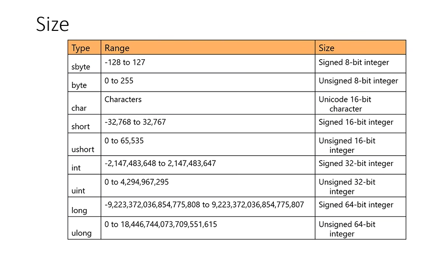
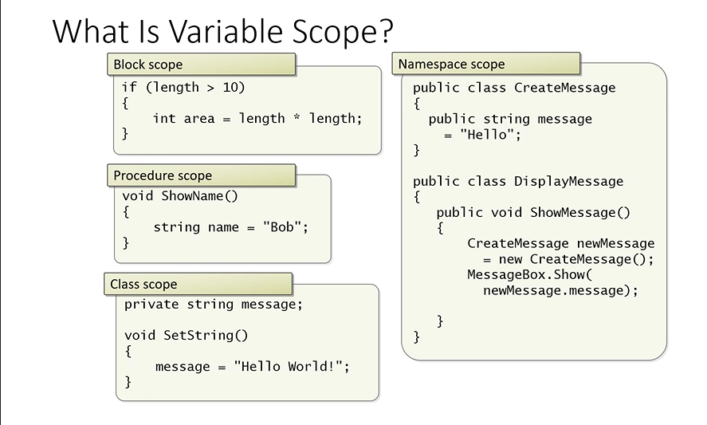
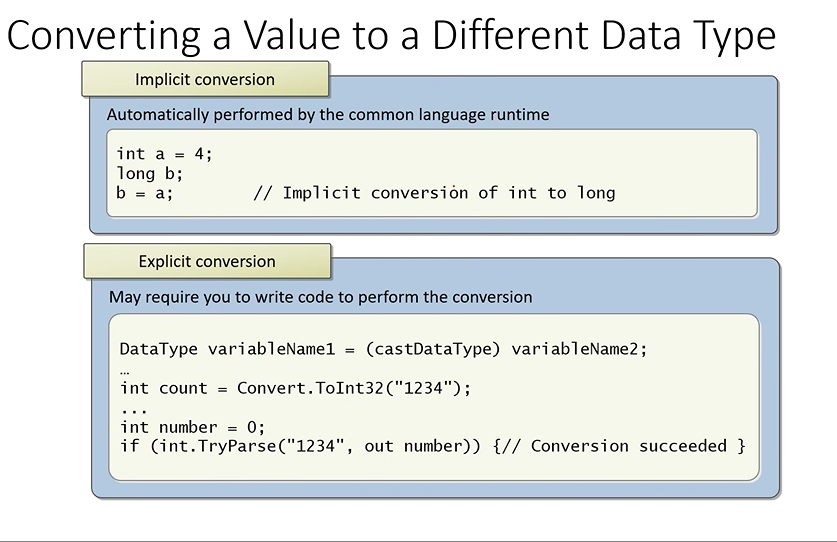

# INTRO
## WHAT IS DOT NET

- desktop ,ui , mobile , web app ,gaming applications

- .NET -> Network enabled technology

- platform from microsoft to build software applications

- platform - Set of resources

- Resources dot net provides
    - Framework
    - IDE's
    - Languages
    - Web Services

- .NET has two flavors -> .NET framework
                      
                       -> .NET core
- console app -> the app will run in console

### FRAMEWORK

- Framework = FCL + CLR

- FCL -> Frame work class library 
     - ready to use collection of classes

- CLR -> Common Language Runtime

- All built in functions are stored in class

-  These classes are stored in GAC(Global Assembly cache) folder (c:\window\assembly)

- Assembly - name given to exe and dll files in dot net

- .dll files -> dynamic link library ( files are stored in this format in a class)


- dot net -> .dll files or .exe files 

- only exe files can be searched in the search bar

- exe files can be opened or executable 

- exe files are interactable

- .dll files needs exe files to open , exe files links the files to dll

- .dll files -> common logic is stored

- collection of all dll files makes FCL

- CLR -> same as role of JVM

- CLR provides runtime environment for .NET applications

- CLR converts IL to native compilers (like byte code to machine language)

- in .NET we save files as .cs files (c sharp)

- CLR is used by languages

- csc -> compilation file
- after compiling -> .exe files 

.png>)

- CLR -> to convert IL code to binary format

- IL code -> to convet code to be platform independent (like byte code)

- Manifest -> which dll version is being used

.png>)

- CLR also allocates memory 

- also handles garbage collection 

- also handles exception (errors) -> generates appropriate error messages

- CLR role 
  1. converts IL code to binary
  2. handles memory
  3. handles exception


- any app we download ->  stored in program files
- OS related files -> stored in windows file


## SYNTAX
- Variables - stores in temporary memory locations
- Every variable has 
    1. Name
    2. Address
    3. Data type
    4. value
    5. scope
    6. lifetime

- Variable Declaration 
  int a;


- Data types 
    - data types with u doesn't support negative
 1. sbyte
 2. byte
 3. char
 4. short
 5. ushort
 6. int 
 7. uint
 8. long
 9. ulong
 10. float - 4 byte
 11. double - 8 byte
 12. decimal - 16 byte
 13. char - 2 bytes
 14. string - depends upon memory
 15. bool - 1 byte
 16. object - also supports custom datatypes ( objects are created from classes)





- global variable - declared inside a class

##### CONVERSION




- namespace -> packages in .NET


```cpp
 namespace new{

    class c1
    {   
        /// this is to add summary 
        ///
        static void main(Stringargs[]){

            int x = 10;
            string s = "Akshita";
            char c = 'm';
            // System -> namespace
            // console -> class
            // WriteLine -> function
            System.Console.WriteLine(s);
            Console.WriteLine(s)
            COnsole.Read(); // command prompt closws only when a key is entered

            string st = Console.ReadLine() ;//for string datatype
            int x = int.Parse(Console.ReadLine()); // to convert from string to other data types

            //Convert class -> to convert from any data type to any data type

        }
    }
}
```

- ildasm -> to read IL file (Intermediate language dissassembler)
- in command prompt 
```cs
ildasm filename 
```
